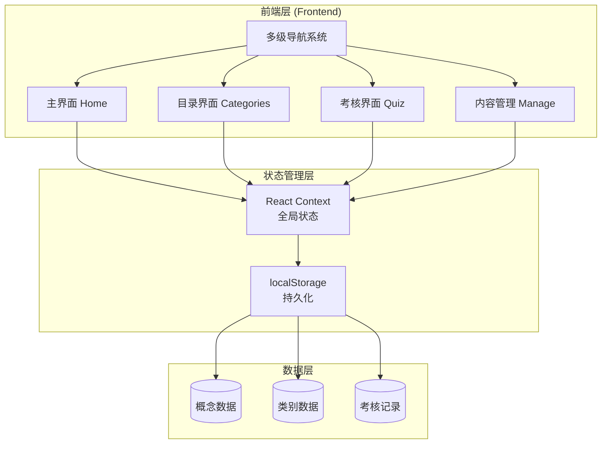

# 知识掌中宝 - 技术架构文档

## 1. 架构设计



**架构说明：**
- 采用 React 18 + Vite 构建
- 使用 React Context 进行全局状态管理
- localStorage 实现数据持久化
- CSS Variables 管理主题样式
- 纯 CSS 实现动画效果

## 2. 技术选型

| 技术 | 版本 | 用途 |
|-----|------|-----|
| React | 18.x | UI 框架 |
| Vite | 5.x | 构建工具 |
| CSS | 3.x | 样式与动画 |
| localStorage | - | 数据持久化 |

**为什么不使用其他技术：**
- 无需后端服务器，纯前端实现
- 无需复杂状态管理库，Context 足够
- 无需 UI 组件库，手写样式更可控

## 3. 路由定义

| 路由 | 页面 | 功能 |
|-----|------|-----|
| `/` | Home | 主界面 - 概览与快速操作 |
| `/categories` | Categories | 目录界面 - 目录树与概念列表 |
| `/quiz` | Quiz | 考核界面 - 记忆考核 |
| `/manage` | Manage | 内容管理界面 |

## 4. 数据模型

### 4.1 概念 (Concept)

```typescript
interface Concept {
  id: string;           // UUID
  name: string;         // 概念名称
  definition: string;   // 定义内容
  categoryId: string;   // 所属类别
  createdAt: number;    // 创建时间戳
  updatedAt: number;    // 更新时间戳
  quizCount: number;    // 考核次数
  correctCount: number; // 正确次数
}
```

### 4.2 类别 (Category)

```typescript
interface Category {
  id: string;           // UUID
  name: string;         // 类别名称
  parentId: string | null; // 父级ID
  order: number;        // 排序
  createdAt: number;   // 创建时间戳
}
```

### 4.3 考核记录 (QuizRecord)

```typescript
interface QuizRecord {
  id: string;           // UUID
  conceptId: string;   // 概念ID
  userAnswer: string;   // 用户答案
  isCorrect: boolean;   // 是否正确
  timestamp: number;    // 考核时间
}
```

## 5. 组件结构

```
src/
├── components/
│   ├── Layout/
│   │   ├── Sidebar.jsx       # 侧边导航
│   │   ├── Header.jsx        # 顶部栏
│   │   └── Layout.jsx        # 布局容器
│   ├── Navigation/
│   │   └── MultiLevelNav.jsx # 多级导航组件
│   ├── Concept/
│   │   ├── ConceptCard.jsx   # 概念卡片
│   │   ├── ConceptForm.jsx   # 概念表单
│   │   └── ConceptList.jsx   # 概念列表
│   ├── Category/
│   │   ├── CategoryTree.jsx  # 目录树
│   │   └── CategoryForm.jsx  # 目录表单
│   └── Quiz/
│       ├── QuizCard.jsx      # 考核卡片
│       └── QuizResult.jsx    # 考核结果
├── pages/
│   ├── Home.jsx              # 主界面
│   ├── Categories.jsx         # 目录界面
│   ├── Quiz.jsx              # 考核界面
│   └── Manage.jsx            # 内容管理界面
├── context/
│   ├── AppContext.jsx         # 全局上下文
│   └── QuizContext.jsx        # 考核状态
├── hooks/
│   ├── useConcepts.js         # 概念操作
│   ├── useCategories.js       # 类别操作
│   └── useQuiz.js             # 考核逻辑
├── utils/
│   ├── storage.js             # localStorage 封装
│   └── helpers.js             # 工具函数
└── styles/
    ├── variables.css          # CSS 变量
    ├── animations.css         # 动画定义
    └── main.css               # 主样式
```

## 6. 核心实现细节

### 6.1 多级导航实现

- 使用递归组件渲染目录树
- 支持展开/折叠动画
- 点击节点选中当前类别
- 状态通过 Context 共享

### 6.2 考核渐隐渐显实现

```css
/* 概念渐隐 */
.concept-fade-out {
  animation: fadeOut 600ms ease-out forwards;
}

/* 定义渐显 */
.definition-fade-in {
  animation: fadeIn 600ms ease-in forwards;
  animation-delay: 200ms;
  opacity: 0;
}

@keyframes fadeOut {
  from { opacity: 1; }
  to { opacity: 0; }
}

@keyframes fadeIn {
  from { opacity: 0; }
  to { opacity: 1; }
}
```

### 6.3 数据持久化

```javascript
// storage.js
const STORAGE_KEY = 'knowledge_app_data';

export const saveData = (key, data) => {
  const all = JSON.parse(localStorage.getItem(STORAGE_KEY) || '{}');
  all[key] = data;
  localStorage.setItem(STORAGE_KEY, JSON.stringify(all));
};

export const loadData = (key) => {
  const all = JSON.parse(localStorage.getItem(STORAGE_KEY) || '{}');
  return all[key] || null;
};
```

## 7. 性能考虑

1. **懒加载页面**：使用 React.lazy 实现路由级代码分割
2. **防抖节流**：搜索和输入使用防抖优化
3. **虚拟列表**：概念列表过长时使用虚拟滚动
4. **记忆化**：使用 useMemo/useCallback 避免不必要的重渲染

## 8. 可访问性

- 所有交互元素支持键盘导航
- 使用语义化 HTML 标签
- 适当的 ARIA 标签
- 动画可被减弱（prefers-reduced-motion）
- 足够的颜色对比度
